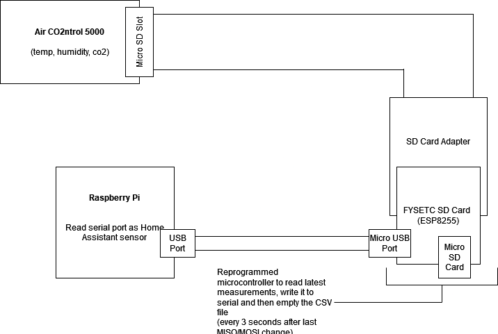
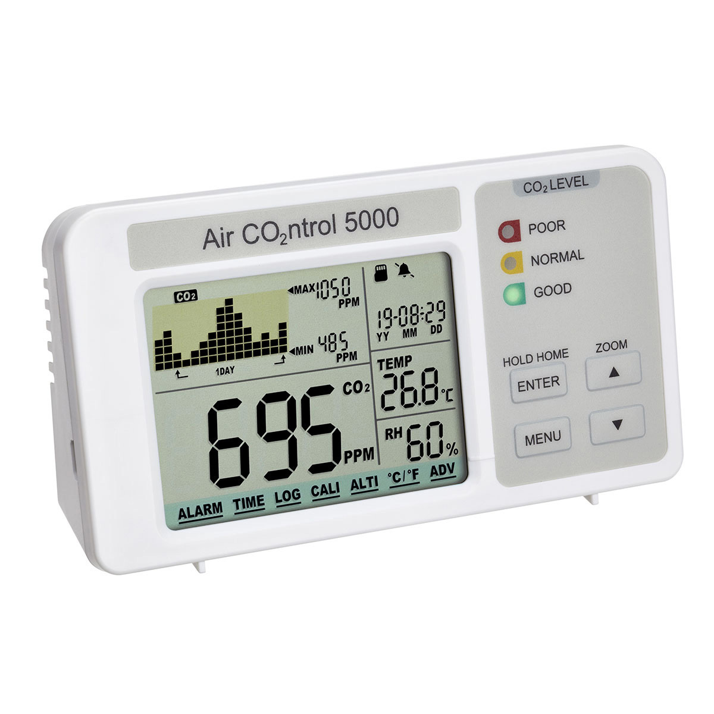
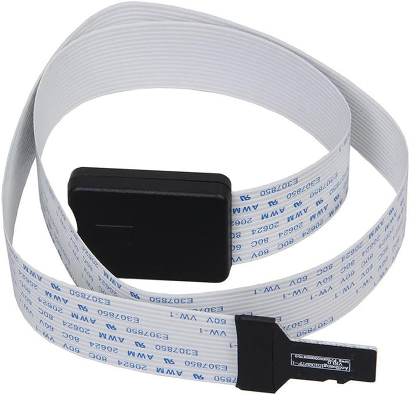
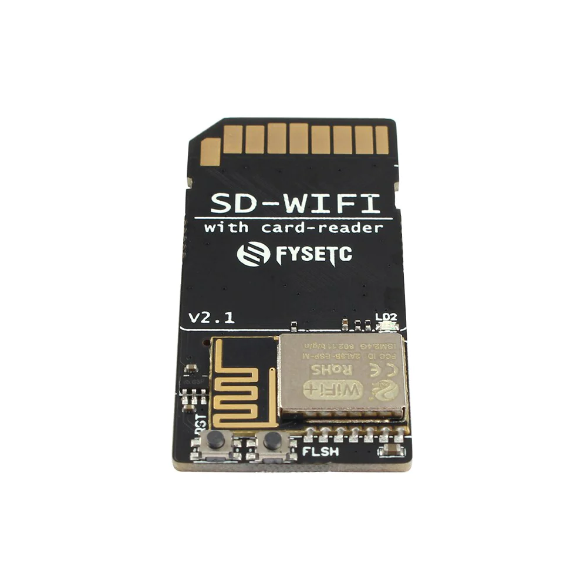

# C022PI

> _Purpose: Read CO2, Humidity and Temperature measurements in real-time from external sensor's MicroSD card through adapters, hacks and bubblegum._

## Introduction

I have an air quality monitor [(AIRCO2NTROL 5000)](https://www.tfa-dostmann.de/en/product/co2-monitor-with-data-logger-airco2ntrol-5000-31-5008) that measures temperature, humidity and CO2 levels.

It supports logging data to MicroSD card, however there is no easy way to read the said data without manually plugging the sd card to computer, _at least before this_.

### Solution description

1. Connect **MicroSD to SD card extension cable** to monitor.
2. Connect programmable card reader module to SD card extension cable, I used **FYSETC SD-WIFI with Card-Reader Module**
3. Connect MicroSD card to card reader module.
4. Use reprogrammed software to read SD card and print latest mesurements to serial console.
5. Connect card reader module to USB and read serial device output with Home Assistant.
6. Hope that the program does not crash.



### How it works?

By attaching interrupts to MISO and MOSI pins we can detect when AirC02ntrol is using the SD card. It seems to write data in 30second intervals, so by waiting 3s after last pin change we can be quite sure that we are safe to read the SD card ourselvers.

Program reads the SD card with [SDFat](https://github.com/greiman/SdFat) library and finds the CSV file that was last modified, and prints the 2nd line of that file to serial (1st line is the header).

After each read it deletes the file to make sure that SD card never fills up and the reading does not take too long.

## Requirements

### Hardware

- **AirC02ntrol 5000**
  
- **MicroSD card**
- **MicroSD to SD card extension cable**
  
- **FYSETC SD-WIFI with Card-Reader Module**
  
- **Micro USB to USB cable**

### Software

- Arduino development environment (I used VSCode extension).
- See setup instructions [here](https://github.com/FYSETC/ESPWebDAV).

## Instructions

1. Update FYSETC SD-WIFI firmware using instructions [here](https://github.com/FYSETC/FYSETC-SD-WIFI).
2. Reprogram onboard ESP8266 controller with this project (see [CO22PI.ino](./CO22PI.ino))
3. Connect everything
4. Add sensor to Home Assistant

### Home Assistant

1. Enable Serial Port interface on Raspberry Pi
2. Add Serial sensor to `configuration.yml`

```yaml
sensor:
  - platform: serial
    serial_port: /dev/ttyUSB0 # Change this to match yours
    baudrate: 9600

template:
  sensor:
    - name: "Temperature"
      unique_id: "custom.hw.temperature"
      unit_of_measurement: "°C"
      state: "{{ states('sensor.serial_sensor').split(',')[4] | float(default=0) }}"
    - name: "Humidity"
      unique_id: "custom.hw.humidity"
      unit_of_measurement: "%"
      state: "{{ states('sensor.serial_sensor').split(',')[5] | float(default=0) }}"
    - name: "CO2"
      unique_id: "custom.hw.co2"
      unit_of_measurement: "ppm"
      state: "{{ states('sensor.serial_sensor').split(',')[3] | float(default=0) }}"
```

## Known issues

- Card reader might sometimes get stuck and AirC02ntrol displays `CARD ERROR`. Can be resolved by re-formatting the SD card.
